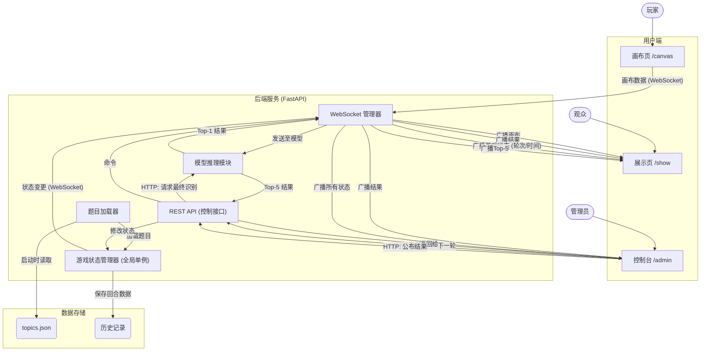

# 项目开发任务清单

这是一个详细的任务清单，用于跟踪和分配具体的开发任务。

## 任务组 F1: 前端 - 画布页面 (`/canvas`)
- [ ] **F1.1**: 画布基础布局 (HTML)
- [ ] **F1.2**: 实现绘画工具栏 (HTML/CSS)
- [ ] **F1.3**: 实现基础绘画功能 (JavaScript)
- [ ] **F1.4**: 实现撤销/重做功能 (JavaScript)
- [ ] **F1.5**: 连接 WebSocket (JavaScript)
- [ ] **F1.6**: 通过 WebSocket 发送画布数据

## 任务组 F2: 前端 - 展示页面 (`/show`)
- [ ] **F2.1**: 展示页基础布局 (HTML/CSS)
- [ ] **F2.2**: 连接 WebSocket (JavaScript)
- [ ] **F2.3**: 接收并展示画作
- [ ] **F2.4**: 接收并展示游戏状态 (轮次、倒计时)
- [ ] **F2.5**: 接收并展示识别结果 (Top-1, Top-5)

## 任务组 F3: 前端 - 控制台页面 (`/admin`)
- [ ] **F3.1**: 控制台基础布局 (HTML/CSS)
- [ ] **F3.2**: 实现游戏控制功能 (HTML, JS)
- [ ] **F3.3**: 实现结果控制功能 (HTML, JS)
- [ ] **F3.4**: 对接后端的 REST API
- [ ] **F3.5**: 连接 WebSocket 并监控实时状态

## 任务组 B1: 后端 - 游戏状态与控制 API
- [ ] **B1.1**: 创建 `topics.json` 及题目加载器
- [ ] **B1.2**: 实现 `GameState` 全局状态管理器
- [ ] **B1.3**: 创建游戏控制 API (Mock)
- [ ] **B1.4**: 实现游戏控制 API (对接 `GameState`)
- [ ] **B1.5**: 实现游戏后台倒计时逻辑
- [ ] **B1.6**: 实现最终识别与公布结果的 API

## 任务组 B2: 后端 - 实时通信 (WebSocket)
- [ ] **B2.1**: 创建 WebSocket 连接管理器
- [ ] **B2.2**: 创建 WebSocket API 接入点 (`/ws/{client_type}`)
- [ ] **B2.3**: 接收并处理来自画布的实时数据
- [ ] **B2.4**: 调用模型并广播画作和识别结果
- [ ] **B2.5**: 广播游戏核心状态的变更

## 任务组 B3: 后端 - 辅助功能
- [ ] **B3.1**: 实现游戏历史记录保存功能
- [ ] **B3.2**: 配置 FastAPI 提供前端静态文件服务

---

# 系统架构设计图 (v1.1)

